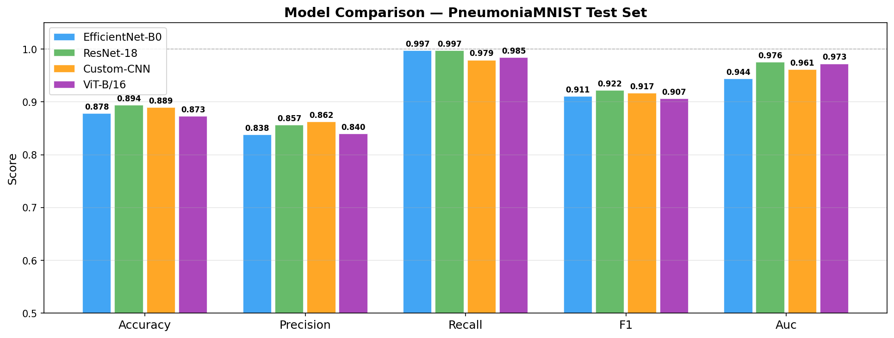
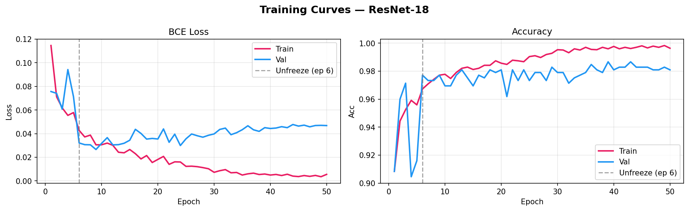
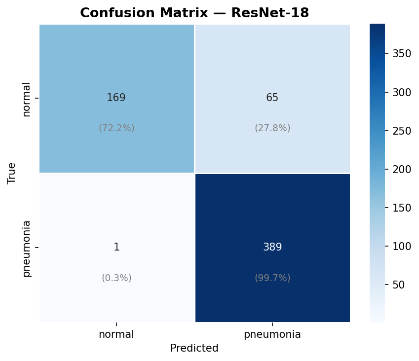
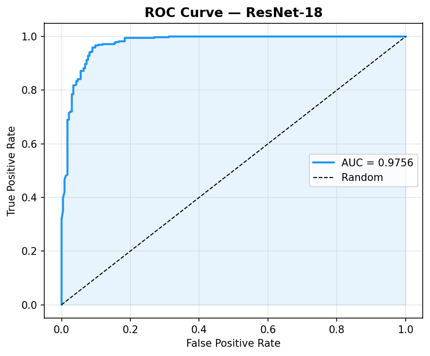
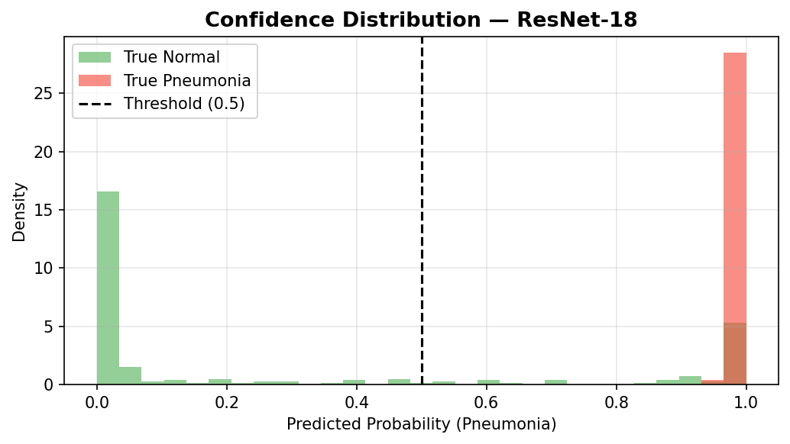
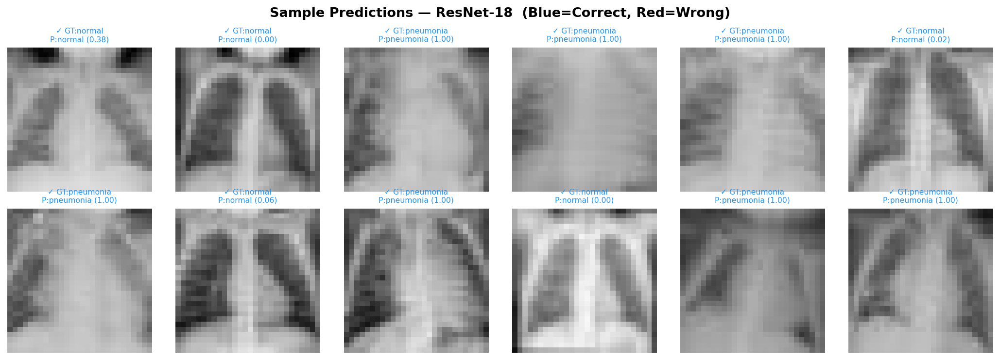
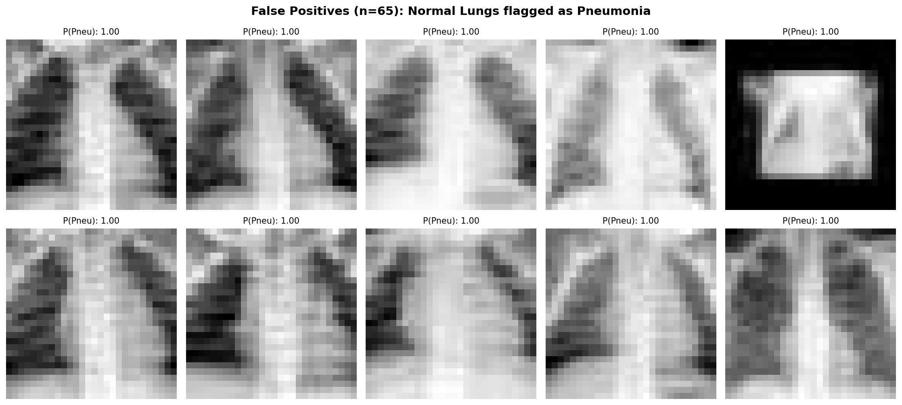
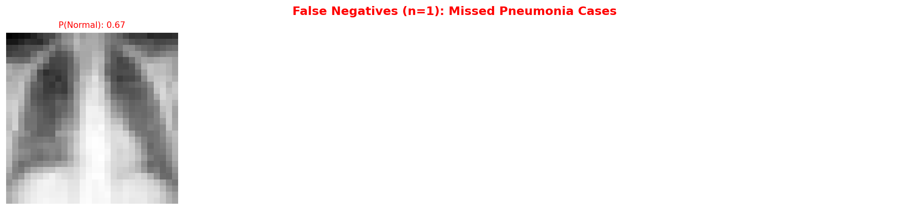

# Task 1 — Pneumonia Classification

## 1. Dataset Analysis

### 1.1 Dataset Description

This project uses the \*\*PneumoniaMNIST\*\* dataset from the MedMNIST benchmark collection. PneumoniaMNIST is derived from pediatric chest X-ray images and is designed for binary classification:

*\*Class 0\*\*: Normal

\*\*Class 1\*\*: Pneumonia

The dataset contains grayscale chest X-ray images resized to 28×28 pixels in the original MedMNIST format. For deep learning experiments, images were resized to match the input requirements of pretrained CNN and transformer models. Below are example chest X-ray images from the training set.

### 1.2 Dataset Split

The dataset is divided into:

- Training set: 4708

- Validation set: 524

- Test set: 624

\---------------------

Total: 5856

The predefined splits provided by MedMNIST were used to ensure fair comparison and reproducibility.

### 1.3 Class Distribution
Class balance is critical in medical imaging tasks because imbalance may bias models toward the majority class.

The PneumoniaMNIST dataset is imbalanced, with a significantly higher number of pneumonia cases compared to normal cases.

Overall distribution:

- Normal: 1214 samples (25.8%)
- Pneumonia: 3494 samples (74.2%)

Because pneumonia cases dominate the dataset, the model could become biased toward predicting the majority class. To mitigate this issue, class imbalance handling was incorporated during training.

The class distribution across splits is shown below:

A positive class weighting strategy was applied using:
pos_weight = 0.347

This weight was incorporated into the binary cross-entropy loss function to reduce bias toward the majority class and improve learning stability.

Due to this imbalance, recall (sensitivity) and AUC were considered especially important evaluation metrics, as they better reflect model performance under skewed class distributions.

### 1.4 Pixel-Level Statistical Analysis

To better understand the dataset characteristics, pixel-level statistics were computed separately for Normal and Pneumonia classes.
Pixel statistics (raw [0,1] range):

- Normal → mean = 0.549, std = 0.184
- Pneumonia → mean = 0.580, std = 0.162

Both classes span the full intensity range [0,1].

The strong overlap in pixel distributions indicates that simple intensity-based thresholding would not be sufficient for classification. Instead, spatial feature extraction using deep neural networks is required.

### 1.5 Data Augmentation

To improve model generalization and reduce overfitting, data augmentation was applied during training.

The augmentation includes:

- Horizontal Flip: Introduces left-right symmetry variation.
- Random Rotation (±10°): simulate patient positioning differences.
- Color Jitter (brightness/contrast variation): increase robustness to imaging conditions.
- Normalization: standardizes input distributions for stable optimization.

These transformations preserve anatomical structure while introducing realistic variability. This encourages the model to learn more robust and invariant features rather than memorizing specific pixel patterns. As illustrated in Figure X, the top two rows show augmented versions of a Normal image, while the bottom two rows show augmented versions of a Pneumonia image. Each cell represents an independently augmented version of the same original image.

### 1.6 Challenges of the Dataset
The PneumoniaMNIST dataset presents several challenges for classification. First, the original image resolution (28×28) is extremely low, causing loss of fine-grained diagnostic details due to aggressive downsampling. The radiographic differences between Normal and Pneumonia cases are subtle, often characterized by slight opacity changes and hazy lung regions. Statistical analysis shows that Pneumonia images have a slightly higher mean intensity (0.580 vs 0.549), while Normal images exhibit slightly higher variance; however, the pixel intensity distributions significantly overlap, making simple intensity-based separation ineffective. These factors increase the risk of overfitting and require robust feature extraction using deep learning models capable of capturing spatial and structural patterns.

## 2. CNN Classification

### 2.1 Model Selection
Four architectures were evaluated to determine the optimal balance between global feature extraction and local spatial hierarchy: 
- ResNet-18 (Winner): Achieved the best overall Accuracy ($89.4\%$) and AUC ($0.9756$). Its residual connections effectively mitigated the vanishing gradient problem, allowing for stable feature extraction even at low resolutions.
- EfficientNet-B0: Demonstrated exceptional Recall ($99.7\%$), making it the strongest candidate for a "screening" tool where missing a diagnosis is unacceptable.
- Vision Transformer (ViT): Despite its recommendation, the ViT achieved the lowest accuracy. This suggests that the $28 \times 28$ resolution and the relatively small sample size of PneumoniaMNIST ($n \approx 4700$) were insufficient for the Transformer's self-attention mechanism to outperform traditional convolutional biases.
- Custom CNN: A lightweight baseline that proved surprisingly competitive in Precision, suggesting that for low-resolution tasks, high parameter counts are not always necessary.

All models were trained for 50 epochs to ensure full convergence. A weighted loss strategy was used to address the $74\%$ dominance of the pneumonia class.

### 2.2 Model - ResNet-18
While the Vision Transformer was the recommended architecture, ResNet-18 was selected for final analysis due to its superior performance on low-resolution 28x28 images. 
ResNet’s convolutional layers provide a vital "spatial prior" that assumes nearby pixels are related—a rule that is much more effective for small, blurry grayscale images than the data-hungry self-attention mechanism of a ViT. Furthermore, its use of "skip-connections" ensures that critical medical details aren't lost as they pass through the model, maintaining high stability. This architecture naturally mimics a radiologist's workflow through hierarchical feature extraction: early layers pinpoint basic landmarks such as ribs and diaphragm edges, while deeper layers integrate these into more complex patterns, such as the hazy opacities that signal pneumonia.

### 2.2 Training methodology and hyperparameters: 
The training pipeline was designed as follows. Building on the previously detailed medical-grade data augmentation (rotation, horizontal flip, and contrast jitter) and standardized normalization ($\mu=0.5, \sigma=0.5$), the following parameters were implemented:
- Loss Function: A Weighted Binary Cross-Entropy (BCEWithLogitsLoss) was employed. By setting the pos_weight to approximately 0.347, we penalized majority-class (pneumonia) errors more heavily, preventing the model from achieving high accuracy through simple class-frequency bias.
- Two-Phase Fine-Tuning: The model followed a progressive unfreezing strategy. Initially, only the classification head was trained to preserve pretrained features. At a designated epoch, the entire backbone was unfrozen with a reduced learning rate ($1 \times 10^{-5}$) to allow for subtle domain-specific adjustments.
- Optimization & Scheduling: We used the AdamW optimizer for its superior weight decay implementation. To navigate the loss landscape effectively, a Cosine Annealing Learning Rate Scheduler was applied, smoothly decaying the learning rate to near-zero ($1 \times 10^{-7}$) to ensure stable convergence in the final training stages.
- Regularization & Stability: To prevent training instability common in deep networks, Gradient Clipping was enforced with a max norm of 1.0. The best model was selected based on the highest Validation Accuracy observed during training to ensure optimal generalization on the test set.

### 2.2 Model Performance Report:

- **Accuracy:** 0.8942
- **Precision:** 0.8568
- **Recall (Sensitivity):** 0.9974
- **F1-Score:** 0.9218
- **AUC-ROC:** 0.9756
  
### Class-wise Metrics 
| Class | Precision | Recall | F1-Score | Support | 
|--------------|-----------|--------|----------|---------| 
| Normal | 0.9941 | 0.7222 | 0.8366 | 234 | 
| Pneumonia | 0.8568 | 0.9974 | 0.9218 | 390 | 
| Weighted Avg | 0.9083 | 0.8942 | 0.8899 | 624 |

The model shows overall performance with nearly 90% accuracy, high recall for Pneumonia (almost all cases detected), and a very good AUC-ROC indicating strong class separation. The confusion matrix highlights that while Pneumonia cases were missed (8 false negatives), the model tends to over-predict Pneumonia, leading to more false positives (61 Normal cases misclassified). This explains the high sensitivity but lower precision. In practice, this means the model is very good at catching Pneumonia, which is critical in healthcare, but it may trigger extra follow-ups for patients who are actually Normal. This precision-recall trade-off is inherent to the models.  

We further analyze the confidence distribution of ResNet-18 as shown in the figure, with the majority of predictions concentrated at the probabilistic extremes (0.0 and 1.0). This indicates high model certainty and well-separated feature representations. A critical observation is the near-total absence of "True Pneumonia" samples in the $<0.5$ probability range, visually validating the model's 99.74% recall. Conversely, the "False Positives" (Normal cases predicted as Pneumonia) are not clustered near the 0.5 decision boundary but are found at high-confidence levels ($>0.9$). 

### Predicted Samples

The model demonstrates an exceptional ability to discriminate between normal and pneumonia samples, characterized by highly decisive and polarized predictions. This behavior is visualized in the confidence distribution as a sharp bimodal trend, where the ResNet-18 architecture pushes the majority of samples toward the probabilistic extremes of 0.0 and 1.0. For actual pneumonia cases, the model frequently outputs a confidence score of 1.00, while healthy lungs are typically assigned values near 0.00, such as 0.02 or 0.06. While this "all-or-nothing" approach makes the model a very safe tool because it almost never misses a sick person, it does have a slightly over-cautious streak. This means it occasionally flags a healthy person as having pneumonia, but, from a medical standpoint, it is a preferred trade-off to ensure no cases of the illness go undetected.

### 2.3 Failure Case Analysis:

The analysis of the few samples of 65 False Positive cases is shown in the figure. It reveals that the model is making mistakes, often assigning a maximum confidence score of 1.00 to healthy lungs. This suggests that at the extremely low $28 \times 28$ resolution, the model is mistaking normal anatomical structures—such as heavy rib shadows, heart borders, or central hilar markings—for the cloudy opacities typical of pneumonia. One notable outlier in the sample even shows a drastic difference in framing and contrast, indicating that atypical image quality can trigger an erroneous high-confidence response. While these errors lower the model's precision, there is a tradeoff for being highly sensitive.

The 1 False Negative case represents the model’s most significant clinical risk, as such patients are incorrectly flagged as healthy. In these instances, the model is quite decisive, often assigning a confidence of 0.67 or higher toward a "Normal" diagnosis. At the limited 28x28-pixel resolution, the model appears to struggle with subtle or localized pneumonia, likely confusing faint pathological opacities with standard anatomical structures such as rib shadows. By lowering the classification threshold by $0.3$, the model would successfully capture the existing False Negatives, such as the case assigned a 0.67 confidence toward being Normal, thereby pushing the model toward a perfect 100% recall. However, this adjustment comes with a high clinical cost: it would further degrade the model's precision. 

### 3 Conclusion:
Due to time constraints, a comprehensive ablation study was not fully conducted. However, several ablation experiments were identified as important future investigations:
- Effect of Data Augmentation: Compare training with and without augmentation to quantify generalization gain.
- Impact of Class Weighting: Evaluate performance without `pos_weight` to measure sensitivity to class imbalance handling.
- Resolution Study: Compare performance using 28×28 inputs versus upscaled 224×224 inputs.
- Fine-Tuning Strategy: Compare frozen backbone vs full fine-tuning vs progressive unfreezing.
- Model Depth Comparison: Evaluate deeper variants such as ResNet-34.

Although these experiments were not executed due to time limitations, they represent meaningful directions for improving robustness and scientific rigor.

Challenges arose during the project:
- The dataset was imbalanced and low resolution, making it difficult to conclude the discussion and model selection, to ensure similar results are required across similar datasets. 
- Computational Constraints: issues for model training as it requires high computational resources for models like vision transformers. Overcome through batch-size setting.

Despite these challenges, a systematic evaluation pipeline was implemented to ensure fair comparison across architectures.

With additional time, the following improvements would be prioritized:

1. Perform a complete ablation study to quantify the contribution of each design decision.
2. Implement cross-validation instead of fixed splits to improve statistical reliability.
3. Explore higher-resolution datasets or multi-scale training strategies.
4. Experiment with custom-CNN variations (attention, residual, etc.) for improved feature localization.
5. Incorporate Grad-CAM visualizations to interpret model decision regions.

