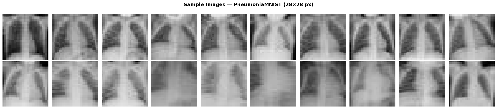
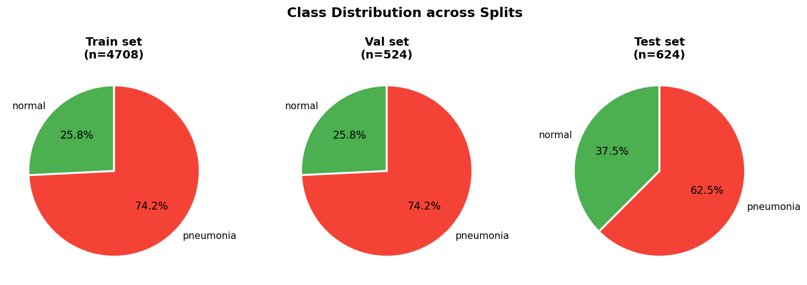
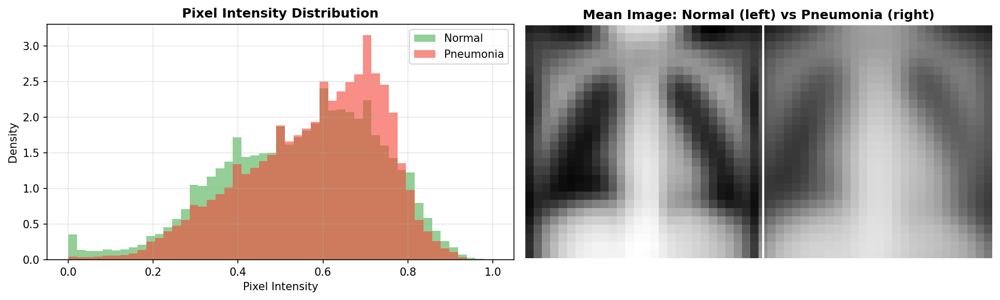
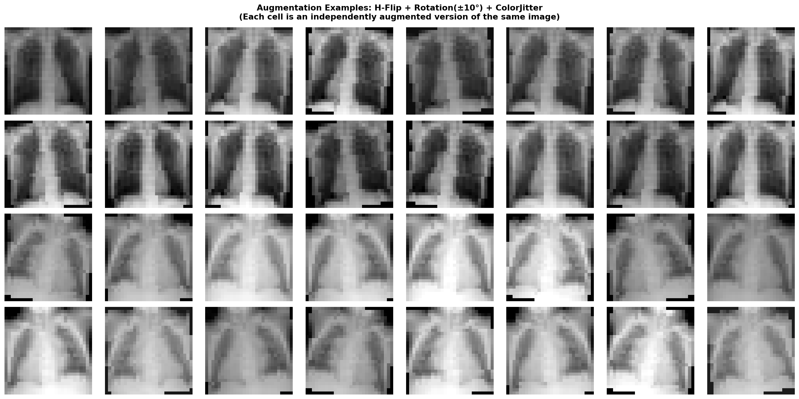

# Task 1 — Pneumonia Classification

## 1. Dataset Analysis

### 1.1 Dataset Description

This project uses the \*\*PneumoniaMNIST\*\* dataset from the MedMNIST benchmark collection. PneumoniaMNIST is derived from pediatric chest X-ray images and is designed for binary classification:

*\*Class 0\*\*: Normal

\*\*Class 1\*\*: Pneumonia

The dataset contains grayscale chest X-ray images resized to 28×28 pixels in the original MedMNIST format. For deep learning experiments, images were resized to match the input requirements of pretrained CNN and transformer models. Below are example chest X-ray images from the training set.

### 1.2 Dataset Split

The dataset is divided into:

- Training set: 4708

- Validation set: 524

- Test set: 624

\---------------------

Total: 5856

The predefined splits provided by MedMNIST were used to ensure fair comparison and reproducibility.

### 1.3 Class Distribution
Class balance is critical in medical imaging tasks because imbalance may bias models toward the majority class.

The PneumoniaMNIST dataset is imbalanced, with a significantly higher number of pneumonia cases compared to normal cases.

Overall distribution:

- Normal: 1214 samples (25.8%)
- Pneumonia: 3494 samples (74.2%)

Because pneumonia cases dominate the dataset, the model could become biased toward predicting the majority class. To mitigate this issue, class imbalance handling was incorporated during training.

The class distribution across splits is shown below:

A positive class weighting strategy was applied using:
pos_weight = 0.347

This weight was incorporated into the binary cross-entropy loss function to reduce bias toward the majority class and improve learning stability.

Due to this imbalance, recall (sensitivity) and AUC were considered especially important evaluation metrics, as they better reflect model performance under skewed class distributions.

### 1.3 Pixel-Level Statistical Analysis

To better understand the dataset characteristics, pixel-level statistics were computed separately for Normal and Pneumonia classes.
Pixel statistics (raw [0,1] range):

- Normal → mean = 0.549, std = 0.184
- Pneumonia → mean = 0.580, std = 0.162

Both classes span the full intensity range [0,1].

The strong overlap in pixel distributions indicates that simple intensity-based thresholding would not be sufficient for classification. Instead, spatial feature extraction using deep neural networks is required.

### 1.3 Data Augmentation

To improve model generalization and reduce overfitting, data augmentation was applied during training.

The augmentation includes:

- Horizontal Flip: Introduces left-right symmetry variation.
- Random Rotation (±10°): simulate patient positioning differences.
- Color Jitter (brightness/contrast variation): increase robustness to imaging conditions.
- Normalization: standardizes input distributions for stable optimization.

These transformations preserve anatomical structure while introducing realistic variability. This encourages the model to learn more robust and invariant features rather than memorizing specific pixel patterns. As illustrated in Figure X, the top two rows show augmented versions of a Normal image, while the bottom two rows show augmented versions of a Pneumonia image. Each cell represents an independently augmented version of the same original image.

### 1.4 Challenges of the Dataset
The PneumoniaMNIST dataset presents several challenges for classification. First, the original image resolution (28×28) is extremely low, causing loss of fine-grained diagnostic details due to aggressive downsampling. The radiographic differences between Normal and Pneumonia cases are subtle, often characterized by slight opacity changes and hazy lung regions. Statistical analysis shows that Pneumonia images have a slightly higher mean intensity (0.580 vs 0.549), while Normal images exhibit slightly higher variance; however, the pixel intensity distributions significantly overlap, making simple intensity-based separation ineffective. These factors increase the risk of overfitting and require robust feature extraction using deep learning models capable of capturing spatial and structural patterns.

## 1. CNN Classification

### 1. Model Selection

