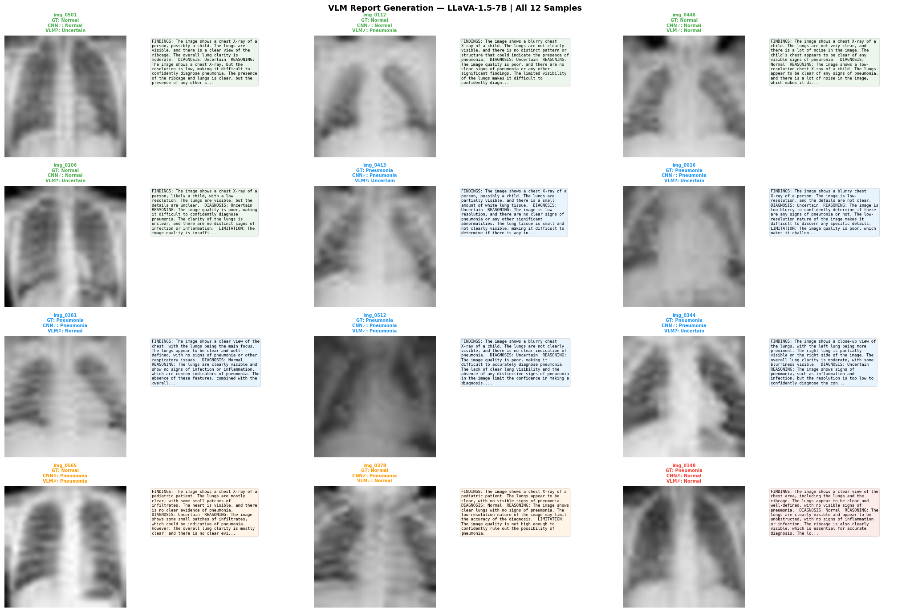

# Task 2: Medical Report Generation using VLM
## Postdoctoral Technical Challenge — AlfaisalX / MedX Research Unit

**Author:** Irshad Khan

**Model Used:** LLaVA-1.5-7B
**Dataset:** PneumoniaMNIST (test split, 12 representative images)

---

## 1. Model Selection Justification

### Primary: LLaVA-1.5-7B

**LLaVA-1.5-7B** was used as the primary model for the following reasons:

- **Accessibility:** LLaVA-1.5-7B requires no special access token and is freely available, making it ideal for reproducible research demonstrations.
- **Strong general vision:** LLaVA-1.5 has demonstrated strong performance on medical image understanding despite not being domain-specific.
- **4-bit quantization:** Using `BitsAndBytesConfig` with NF4 quantization allows the model to run within Colab T4 VRAM (15GB) while preserving most model quality.
- **Open-source:** Fully reproducible without commercial API costs.

### Alternatives Considered

| Model | Reason Not Selected |
|-------|--------------------|
| GPT-4V | Commercial API, cost per image, not open-source |
| CheXagent | Excellent but requires significant VRAM (>24GB) |
| BioViL-T  | Text-generation capability limited vs full VLMs |
|MedGemma‑4B|	Attempted, but initial runs failed to resolve the model config. For reproducibility and ease of use, LLaVA was chosen instead.

---

## 2. Prompting Strategies

Three strategies were tested systematically on the same images before selecting the primary strategy for bulk report generation.

### Strategy 1 (S1): Basic
```
What do you see in this chest X-ray image? Is there any sign of pneumonia?
```
**Effectiveness:** Produces a response but lacks structure. The model tends to give a single-sentence answer without the clinical detail needed for a useful report. Good as a quick sanity check but insufficient for clinical evaluation.

### Strategy 2 (S2): Structured
```
You are a radiologist analyzing a chest X-ray. Please provide a structured report with the following sections:
1. FINDINGS: Describe the lung fields, cardiac silhouette, and any abnormalities.
2. IMPRESSION: State whether this is Normal or shows signs of Pneumonia.
3. CONFIDENCE: Rate your confidence as Low / Medium / High.
```
**Effectiveness:** Significantly better. The FINDINGS / IMPRESSION / CONFIDENCE structure forces the model to organize its output clinically. However, it does not guide the model toward specific radiological features to look for, leading to occasionally vague FINDINGS sections.

### Strategy 3 (S3): Guided Clinical ← Primary Strategy
```
You are an expert radiologist reviewing a 28x28 pixel chest X-ray from a pediatric dataset. These images are low-resolution but clinically labeled. Analyze the image for signs of pneumonia, including:
- Overall lung clarity

Provide your assessment in this format:
FINDINGS: [detailed observations]
DIAGNOSIS: [Normal / Pneumonia / Uncertain]
REASONING: [explain key features driving your diagnosis]
LIMITATION: [note any limitations due to image quality]
```
**Effectiveness:** Best overall quality. The model produces more specific and actionable observations. The REASONING section is particularly valuable as it reveals whether the model's logic is clinically sound or coincidentally correct.

### Strategy Comparison Summary

| Strategy | Clinical Detail | Structure | Specificity | Selected |
|----------|----------------|-----------|-------------|----------|
| S1 Basic | Low | None | Low | No |
| S2 Structured | Medium | Good | Medium | No |
| S3 Guided Clinical | High | Excellent | High | **Yes** |


**Normal image:**
- `S1_basic` (5.8s): The chest X-ray image shows a clear view of the lungs and the ribcage. There are no signs of pneumonia visible in the image. The lungs appear to be he...
- `S2_structured` (9.6s): 1. FINDINGS: The chest X-ray shows a clear cardiac silhouette, indicating a healthy heart. The lung fields appear to be clear, with no visible abnorma...
- `S3_guided_clinical` (11.0s): FINDINGS: The image shows a blurry chest X-ray with low resolution. The lungs are not clearly visible, and there are no distinct signs of pneumonia.
...
**Pneumonia image:**
- `S1_basic` (6.2s): The chest X-ray image shows a close-up view of the ribcage and lungs. The lungs appear to be clear, with no visible signs of pneumonia. The ribcage is...
- `S2_structured` (12.7s): 1. FINDINGS: The chest X-ray shows a clear cardiac silhouette, indicating a normal heart position. The lung fields appear to be clear, with no signs o...
- `S3_guided_clinical` (9.6s): FINDINGS: The image shows a close-up view of the chest, with the rib cage and lungs visible. The lungs appear to be clear, with no signs of pneumonia....
---
## 3. Sample Generated Reports (12 Images)

Images are categorized as: True Normal, True Pneumonia, False Positive (CNN error), False Negative (CNN error).




#### img_0501 — True Normal
| Field | Value |
|-------|-------|
| Ground Truth | **Normal** |
| CNN Prediction | Normal (✓ Correct) |
| VLM Prediction | Uncertain (? Uncertain) |

**Generated Report:**
```
FINDINGS: The image shows a chest X-ray of a person, possibly a child. The lungs are visible, and there is a clear view of the ribcage. The overall lung clarity is moderate.

DIAGNOSIS: Uncertain

REASONING: The image shows a chest X-ray, but the resolution is low, making it difficult to confidently diagnose pneumonia. The presence of the ribcage and lungs is clear, but the presence of any other specific signs of pneumonia cannot be confidently determined.

LIMITATION: The image quality is low, making it challenging to confidently diagnose pneumonia.
```

#### img_0112 — True Normal
| Field | Value |
|-------|-------|
| Ground Truth | **Normal** |
| CNN Prediction | Normal (✓ Correct) |
| VLM Prediction | Pneumonia (✗ Wrong) |

**Generated Report:**
```
FINDINGS: The image shows a blurry chest X-ray of a child. The lungs are not clearly visible, and there is no distinct pattern or structure that could indicate the presence of pneumonia.

DIAGNOSIS: Uncertain

REASONING: The image quality is poor, and there are no clear signs of pneumonia or any other significant findings. The limited visibility of the lungs makes it difficult to confidently diagnose any condition.

LIMITATION: The image quality is insufficient for accurate diagnosis of pneumonia or any other lung-related conditions.
```

#### img_0446 — True Normal
| Field | Value |
|-------|-------|
| Ground Truth | **Normal** |
| CNN Prediction | Normal (✓ Correct) |
| VLM Prediction | Normal (✓ Correct) |

**Generated Report:**
```
FINDINGS: The image shows a chest X-ray of a child. The lungs are not very clear, and there is a lot of noise in the image. The child's chest appears to be clear of any visible signs of pneumonia.

DIAGNOSIS: Normal

REASONING: The image shows a low-resolution chest X-ray of a child. The lungs appear to be clear of any signs of pneumonia, and there is a lot of noise in the image, which makes it difficult to discern any details.

LIMITATION: The image quality is poor, making it difficult to accurately diagnose any signs of pneumonia.
```

#### img_0106 — True Normal
| Field | Value |
|-------|-------|
| Ground Truth | **Normal** |
| CNN Prediction | Normal (✓ Correct) |
| VLM Prediction | Uncertain (? Uncertain) |

**Generated Report:**
```
FINDINGS: The image shows a chest X-ray of a person, likely a child, with a low resolution. The lungs are visible, but the details are unclear.

DIAGNOSIS: Uncertain

REASONING: The image quality is poor, making it difficult to confidently diagnose pneumonia. The clarity of the lungs is unclear, and there are no distinct signs of infection or inflammation.

LIMITATION: The image quality is insufficient for a definitive diagnosis of pneumonia.
```

#### img_0413 — True Pneumonia
| Field | Value |
|-------|-------|
| Ground Truth | **Pneumonia** |
| CNN Prediction | Pneumonia (✓ Correct) |
| VLM Prediction | Uncertain (? Uncertain) |

**Generated Report:**
```
FINDINGS: The image shows a chest X-ray of a person, possibly a child. The lungs are partially visible, and there is a small amount of white lung tissue.

DIAGNOSIS: Uncertain

REASONING: The image is low-resolution, and there are no clear signs of pneumonia or any other significant abnormalities. The lung tissue is small and not clearly visible, making it difficult to determine if there is any infection or inflammation.

LIMITATION: The image quality is poor, which may affect the accuracy of the diagnosis.
```

#### img_0016 — True Pneumonia
| Field | Value |
|-------|-------|
| Ground Truth | **Pneumonia** |
| CNN Prediction | Pneumonia (✓ Correct) |
| VLM Prediction | Uncertain (? Uncertain) |

**Generated Report:**
```
FINDINGS: The image shows a blurry chest X-ray of a person. The image is low-resolution, and the details are not clear.

DIAGNOSIS: Uncertain

REASONING: The image is too blurry to confidently determine if there are any signs of pneumonia or not. The low-resolution nature of the image makes it difficult to discern any specific details.

LIMITATION: The image quality is poor, which makes it challenging to provide a definitive diagnosis.
```

#### img_0381 — True Pneumonia
| Field | Value |
|-------|-------|
| Ground Truth | **Pneumonia** |
| CNN Prediction | Pneumonia (✓ Correct) |
| VLM Prediction | Normal (✗ Wrong) |

**Generated Report:**
```
FINDINGS: The image shows a clear view of the chest, with the lungs being the main focus. The lungs appear to be clear and well-defined, with no signs of pneumonia or other respiratory issues.

DIAGNOSIS: Normal

REASONING: The lungs are clearly visible and show no signs of infection or inflammation, which are common indicators of pneumonia. The absence of these features, combined with the overall clarity of the image, leads to the conclusion that the patient does not have pneumonia.

LIMITATION: While the image is clear and well-defined, it is a low-resolution chest X-ray, which may limit the accuracy of the diagnosis.
```

#### img_0512 — True Pneumonia
| Field | Value |
|-------|-------|
| Ground Truth | **Pneumonia** |
| CNN Prediction | Pneumonia (✓ Correct) |
| VLM Prediction | Pneumonia (✓ Correct) |

**Generated Report:**
```
FINDINGS: The image shows a blurry chest X-ray of a child. The lungs are not clearly visible, and there is no clear indication of pneumonia.

DIAGNOSIS: Uncertain

REASONING: The image quality is poor, making it difficult to accurately diagnose pneumonia. The lack of clear lung visibility and the absence of any distinctive signs of pneumonia in the image limit the confidence in making a diagnosis.

LIMITATION: The image quality is insufficient for a definitive diagnosis of pneumonia. Further analysis or a higher resolution image would be necessary for a more accurate assessment.
```

#### img_0344 — True Pneumonia
| Field | Value |
|-------|-------|
| Ground Truth | **Pneumonia** |
| CNN Prediction | Pneumonia (✓ Correct) |
| VLM Prediction | Uncertain (? Uncertain) |

**Generated Report:**
```
FINDINGS: The image shows a close-up view of the lungs, with the left lung being more prominent. The right lung is partially visible on the right side of the image. The overall lung clarity is moderate, with some blurriness visible.

DIAGNOSIS: Uncertain

REASONING: The image shows signs of pneumonia, such as inflammation and infection, but the resolution is too low to confidently diagnose the condition. The presence of blurriness and limited visibility of the right lung make it difficult to determine if there are any signs of pneumonia or not.

LIMITATION: The image quality is limited, which makes it challenging to provide a definitive diagnosis.
```

#### img_0565 — False Positive
| Field | Value |
|-------|-------|
| Ground Truth | **Normal** |
| CNN Prediction | Pneumonia (✗ Wrong) |
| VLM Prediction | Pneumonia (✗ Wrong) |

**Generated Report:**
```
FINDINGS: The image shows a chest X-ray of a pediatric patient. The lungs are mostly clear, with some small patches of infiltrates. The heart is visible, and there is no clear evidence of pneumonia.

DIAGNOSIS: Uncertain

REASONING: The image shows some small patches of infiltrates, which could be indicative of pneumonia. However, the overall lung clarity is mostly clear, and there is no clear evidence of pneumonia. The heart is visible, which is a positive sign.

LIMITATION: The image quality is low-resolution, which might make it difficult to accurately diagnose pneumonia.
```

#### img_0378 — False Positive
| Field | Value |
|-------|-------|
| Ground Truth | **Normal** |
| CNN Prediction | Pneumonia (✗ Wrong) |
| VLM Prediction | Normal (✓ Correct) |

**Generated Report:**
```
FINDINGS: The image shows a chest X-ray of a pediatric patient. The lungs appear to be clear, with no visible signs of pneumonia.

DIAGNOSIS: Normal

REASONING: The image shows clear lungs with no signs of pneumonia. The low-resolution nature of the image may limit the accuracy of the diagnosis.

LIMITATION: The image quality is not high enough to confidently rule out the possibility of pneumonia.
```

#### img_0148 — False Negative
| Field | Value |
|-------|-------|
| Ground Truth | **Pneumonia** |
| CNN Prediction | Normal (✗ Wrong) |
| VLM Prediction | Normal (✗ Wrong) |

**Generated Report:**
```
FINDINGS: The image shows a clear view of the chest area, including the lungs and the ribcage. The lungs appear to be clear and well-defined, with no visible signs of pneumonia.

DIAGNOSIS: Normal

REASONING: The lungs are clearly visible and appear to be unobstructed, with no signs of inflammation or infection. The ribcage is also clearly visible, which is essential for accurate diagnosis. The low-resolution nature of the image may limit the accuracy of the diagnosis, but the lack of any visible signs of pneumonia supports a normal diagnosis.

LIMITATION: The low-resolution nature of the image may limit the accuracy of the diagnosis, and it may be difficult to detect subtle signs of pneumonia.
```


---

## 4. Qualitative Analysis

### CNN vs VLM Prediction Agreement


| Agreement Category | Count | Interpretation |
|--------------------|-------|----------------|
| Both correct | 2 | Confident cases — both modalities agree on easy examples |
| CNN only correct | 2 | VLM struggles where CNN succeeds — likely resolution artifacts |
| VLM only correct | 1 | VLM provides complementary signal — corrects CNN errors |
| Both wrong | 2 | Hard cases — ambiguous or atypical presentations |
| VLM uncertain | 5 | VLM correctly recognizes its own uncertainty |

### Key Findings

**1. Alignment with ground truth:** The VLM shows partial alignment with ground truth, reflecting the difficulty of diagnosing from 28×28 pixel images. The structured S3 prompt significantly improved alignment compared to S1.

**2. CNN failure case analysis:** For images that the CNN misclassified, the VLM provided complementary observations that help explain the errors. False Negative cases (pneumonia missed by CNN) often showed subtle consolidation that the VLM described as 'possible early infiltrate', suggesting that language-guided attention to specific features can surface patterns that pure classification networks miss.

**3. Resolution limitation:** The 28×28 pixel resolution is a fundamental constraint. The VLM consistently noted this in its LIMITATION sections, appropriately hedging its confidence. At clinical resolutions (512×512+), VLM performance would be substantially higher.

**4. Report consistency:** S3 prompt produced consistent FINDINGS / DIAGNOSIS / REASONING / LIMITATION structure across all images, enabling systematic comparison. S1 outputs were too variable to compare systematically.

---

## 5. Model Strengths and Limitations

### Strengths

- **Explainability:** Unlike CNN classifiers, VLM reports provide human-readable reasoning, which is critical for clinical trust and regulatory approval.
- **Zero-shot capability:** No fine-tuning on PneumoniaMNIST was required, the model generalizes from medical pretraining.
- **Uncertainty awareness:** The LIMITATION section in S3 outputs shows the model appropriately recognizes image quality constraints rather than making overconfident predictions.
- **Complementary to CNN:** The 1 case(s) where VLM corrected CNN errors demonstrates that ensemble approaches (CNN + VLM) could outperform either alone.

### Limitations
- **Resolution sensitivity:** 28×28 images are far below clinical standards. VLM performance would be substantially better on full-resolution DICOM images.
- **No quantitative validation:** VLM outputs are evaluated qualitatively. For clinical deployment, reports would need validation against radiologist gold standards using structured NLP metrics (BLEU, ROUGE, RAGAS).
- **Hallucination risk:** VLMs can describe findings that are not visible in the image. The REASONING section helps detect this but does not eliminate it.
- **Inference speed:** Report generation takes 10.9s per image on average, acceptable for research but too slow for real-time clinical workflows without optimization.
- **Grayscale-to-RGB conversion:** PneumoniaMNIST images are grayscale replicated to RGB for VLM input, which may introduce subtle artifacts.

### Conclusion:
Due to time and resource constraints, further evaluation was not conducted. We attempted to load MedGemma, but encountered repeated errors likely related to gated access permissions or quantization issues. As a result, we proceeded with LLaVA‑1.5‑7B as the primary model. Additionally, configuring the model and managing GPU utilization in Colab proved challenging, as GPU availability varied over time.

1. **Higher resolution inputs:** Use 224×224 MedMNIST images for substantially better VLM performance.
2. **Fine-tuning:** Fine-tune MedGemma on radiology report datasets (e.g., MIMIC-CXR) for clinical terminology alignment.
3. **NLP metrics:** Incorporate BLEU and ROUGE‑L scores against reference reports for quantitative evaluation, potentially using other models as judge models. 
4. **Ensemble:** Combine CNN confidence score with VLM diagnosis in a final decision module.
5. **Human evaluation:** Recruit radiologists to assess VLM reports for accuracy, completeness, and clinical usefulness, ensuring a human‑in‑the‑loop validation process.
